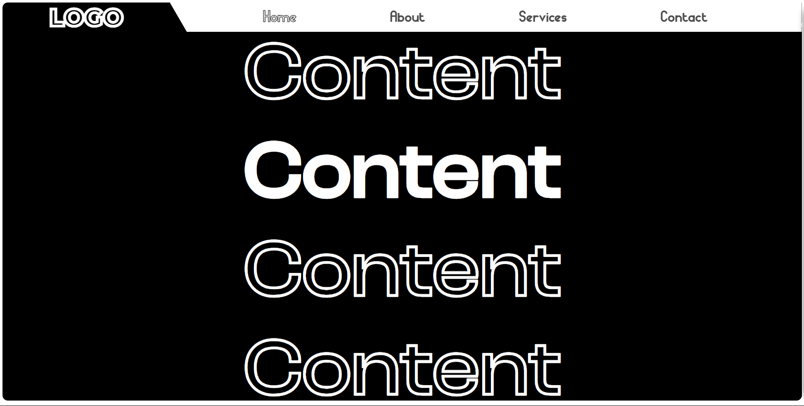
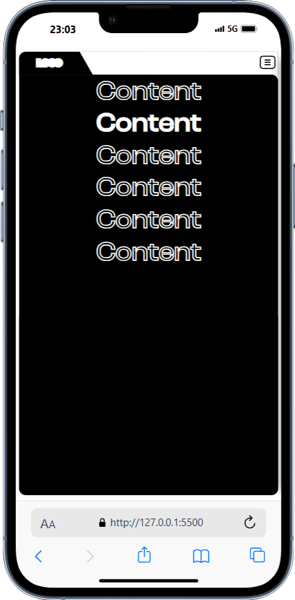
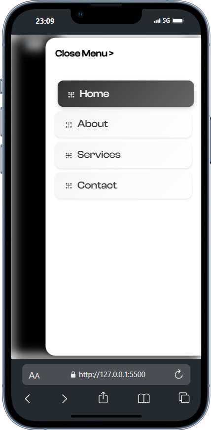

# Responsive Navigation Bar
This project features a **modern, responsive navigation bar** built using **HTML, CSS, and JavaScript**, designed to deliver a seamless user experience across all screen sizes.

## ✨ Features

- 🔲 **Desktop Navigation Bar**
  - Horizontal layout with navigation links: `Home`, `About`, `Services`, `Contact`
  - Bold logo and clean, minimalist design
  - Optimized for wide screen viewing

- 📱 **Mobile Sidebar Menu**
  - Slide-in sidebar for smaller screens
  - Smooth transition animations on open/close
  - Card-style buttons with soft shadows and hover effects
  - “Close Menu” link for quick dismissal

- 🎨 **UI Styling**
  - Stylish typography and modern layout
  - Light/dark contrast theme for clear visibility
  - Rounded corners and smooth transitions enhance user experience

- ⚙️ **Responsive Layout**
  - Fully responsive with a mobile-first design approach
  - Works on desktops, tablets, and smartphones
  - Maintains consistency in UX/UI across breakpoints

## 📸 Screenshots

### 💻 Desktop View



### 📱 Mobile Sidebar View

<p align="start">
  
  &nbsp;&nbsp;&nbsp;
  
</p>


## 🛠️ Technologies Used

- **HTML5**
- **CSS3** (Flexbox, Media Queries)
- **JavaScript** (Vanilla JS for toggle functionality)

## 📂 Folder Structure

<pre> /responsive-navbar
      ├── index.html 
      ├── /styles 
      │ └── style.css 
      ├── /scripts 
      │ └── script.js 
      └── /images </pre>

## 🚀 Getting Started

1. Clone this repository:
```bash
git clone https://github.com/your-username/responsive-navbar.git
```
2. Open index.html in any web browser.

3. Resize the window to observe the responsive behavior.

⭐️ Star this repo if you like it and feel free to fork or contribute!
